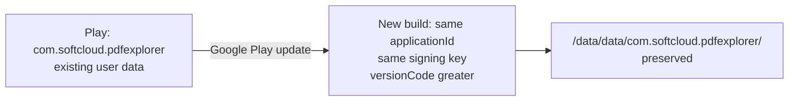

# SoftCloud Rebrand Checklist — PDF Explorer

**Status:** Phase R0 in progress — no code changes until R0 finalized  
**Official repository:** https://github.com/asporkan/softcloud-pdf-explorer  
**Design reference:** Brand board (PDF Explorer / SoftCloud — *Explore. Edit. Organize.*)  
**Created:** 2026-07-04 · **R0 updated:** 2026-07-04  
**Related:** [Master Plan](pdf_explorer_master_plan_33f27232.plan.md) · [AGENTS.md](../../AGENTS.md)

---

## Phase R0 — Decision Record

### Confirmed (2026-07-04)

| ID | Decision | Value |
|----|----------|-------|
| **R0.2** | Official public repository | **https://github.com/asporkan/softcloud-pdf-explorer** |
| **R0-PLAY-1** | Product type | **Play Store in-place update** — not a new app listing |
| **R0-PLAY-2** | `applicationId` (required) | **`com.softcloud.pdfexplorer`** |
| **R0-PLAY-3** | Signing | **Reuse original Play signing key** |
| **R0-PLAY-4** | `versionCode` rule | **Always > latest Play Store release** |
| **R0-PLAY-5** | Upgrade path | **No uninstall**; preserve `/data/data/com.softcloud.pdfexplorer/` |
| **R0-OSS-1** | License strategy | **Fully open source**, GPL-compatible development |
| **R0-OSS-2** | Upstream attribution | **Keep where GPL requires** (fork lineage in Licenses / NOTICE) |
| **R0-PRIV-1** | Privacy policy | **Do NOT reuse** existing in-app text — new policy after codebase audit |
| **R0-URL-1** | All repo references | README, About, Settings, Constants, issue templates → **asporkan/softcloud-pdf-explorer** |

**Repository URL usage map** (replace upstream `ahmmedrejowan/PdfReaderPro`):

| Location | File |
|----------|------|
| Source code link | [`Constants.kt`](../../app/src/main/java/com/rejowan/pdfreaderpro/util/Constants.kt) |
| Update checker | [`SettingsViewModel.kt`](../../app/src/main/java/com/rejowan/pdfreaderpro/presentation/screens/settings/SettingsViewModel.kt) |
| Settings GitHub button | [`SettingsScreenContent.kt`](../../app/src/main/java/com/rejowan/pdfreaderpro/presentation/screens/settings/SettingsScreenContent.kt) |
| Issue templates | [`.github/ISSUE_TEMPLATE/config.yml`](../../.github/ISSUE_TEMPLATE/config.yml) |
| CI / release workflows | [`.github/workflows/`](../../.github/workflows/) |
| README, CONTRIBUTING, CHANGELOG | repo root |

| **R0-PLAY-6** | Latest Play `versionCode` | **3** → first release **`versionCode = 4`** (confirmed) |
| **R0.1** | Developer / support | **SoftCloud** · **contact@softcloud.com.tr** · website TBD |
| **R0.3** | Privacy policy URL | **Hosted page TBD** — draft in-app first (R-PRIV); public URL required before Play submission |
| **R0.4** | Tool output folder | **`PdfExplorer`** (Documents/PdfExplorer/, Pictures/PdfExplorer/) |
| **R0.5** | Brand colors | **Proposed tokens approved as default** until design provides exact hex |
| **R0.6** | Adaptive icon | **Deferred** — concept reference only; R4 when assets ready |

GitHub API (update checker, until removed): `https://api.github.com/repos/asporkan/softcloud-pdf-explorer/releases/latest`

**R0 status: FINALIZED** (2026-07-04) — R1 may begin. Play submission still requires: privacy public URL (R0.3), legacy data migration (R8.4), adaptive icon (R4 optional for first upload).

### Proposed brand color tokens (R0.5 — pending sign-off)

From design board (blue → purple primary; feature accents):

| Token | Proposed hex | Use |
|-------|--------------|-----|
| `brandBlue` | `#3B82F6` | View / primary gradient start |
| `brandPurple` | `#7C3AED` | Edit / primary gradient end |
| `brandRed` | `#EF4444` | PDF badge (icon only) |
| `brandGreen` | `#22C55E` | Organize |
| `brandOrange` | `#F97316` | Secure / lock tools |
| `surfaceLight` | `#FFFFFF` | Light background |
| `surfaceDark` | `#0F172A` | Dark background (navy) |

Current repo purple (`#7A59DA`, `#7B68EE`) will be replaced in Phase R3.

---

## Play Store Migration Constraints (architectural)

All rebrand and migration work must preserve **in-place update**:

| Constraint | Implication |
|------------|-------------|
| Same `applicationId` | Package rename (R8) is **mandatory** before Play upload, not optional |
| Same signing key | `keystore.properties` must use **original Play key** |
| Higher `versionCode` | Reset upstream numbering (repo is 7); align to Play lineage |
| No uninstall | Room/DataStore/SP migration from **old app schema** required (separate epic — dump pending) |
| `allowBackup=false` | User data stays on device; migration runs on first launch after update |

**Implementation order:** Visual rebrand (R1–R7) can precede R8, but **Play release requires R8 + legacy data migration**.

---

## Brand Targets (from design reference)

| Element | Current (repo) | Target |
|---------|----------------|--------|
| App display name | PDF Reader Pro | **PDF Explorer** |
| Tagline | *(none unified)* | **Explore. Edit. Organize.** |
| Marketing line | Various onboarding strings | **All your PDF tools in one place.** |
| Publisher / developer | K M Rejowan Ahmmed | **SoftCloud** · contact@softcloud.com.tr |
| Primary visual | Purple/violet Material theme | **Blue → purple gradient** (brand board) |
| Feature accents | Mixed UI colors | **Blue** View · **Purple** Edit · **Green** Organize · **Orange** Secure |
| Launcher / splash icon | Upstream PdfReaderPro assets | **New adaptive icon** — *deferred; use concept as reference only* |
| `applicationId` | `com.rejowan.pdfreaderpro` | **`com.softcloud.pdfexplorer`** — R8 (confirmed requirement) |

---

## Scope Boundaries

### In scope — Rebrand Track (this checklist)

User-visible naming, visuals, copy, URLs, legal attribution text, store/repo metadata, output folder names on disk.

### Out of scope for R1–R7 (separate gated tasks)

- Kotlin package / namespace rename (R8)
- Legacy Room/SP migration from old Play app (Phase 0 dump)
- GitHub sideload update system removal (may affect privacy policy wording)
- Adaptive icon **production assets** (placeholder OK until R4)
- **New privacy policy text** — audit complete (below); **draft in R-PRIV after R0 finalized**

---

## Privacy Codebase Audit (R0 — verified from local repo)

**Purpose:** Factual basis for a **new** Privacy Policy. The existing in-app policy in [`strings.xml`](../../app/src/main/res/values/strings.xml) (`privacy_*`) is **obsolete and must not be reused**.

### SDKs and libraries (runtime)

| Component | Version | Role | Sends data off-device? |
|-----------|---------|------|------------------------|
| AndroidX Core, Compose, Material3 | BOM 2026.03.01 | UI | No |
| Room | 2.8.4 | Local SQLite | No |
| DataStore Preferences | 1.2.1 | Local preferences | No |
| Koin | 4.2.0 | DI | No |
| Ktor Client (Android) | 3.4.2 | HTTP — GitHub Releases API only | **Yes** (optional update check) |
| Coil | 2.7.0 | Image loading (local/cache) | Only if user opens remote PDF URL |
| Timber | 5.0.1 | Debug logging only (`ENABLE_LOGGING=true`) | No in release |
| Lottie | 6.7.1 | Animations (bundled JSON) | No |
| AndroidX WebKit | 1.15.0 | PDF.js WebView | Only if user loads remote PDF |
| PDF.js (bundled) | 5.3.31 | PDF rendering | No (local assets) |
| iText + Bouncy Castle | 9.6.0 / 1.83 | PDF tools (merge, split, etc.) | No |
| Licensy Compose | 1.1.0 | OSS license display | No |
| SplashScreen compat | 1.2.0 | Splash | No |
| Reorderable | 3.0.0 | UI drag-reorder | No |

**Not present (verified by dependency + code search):** Firebase, Google Analytics, Crashlytics, Sentry, AdMob, Facebook SDK, any advertising or crash-reporting SDK.

### Android permissions ([`AndroidManifest.xml`](../../app/src/main/AndroidManifest.xml))

| Permission | Purpose |
|------------|---------|
| `INTERNET` | GitHub update API; optional remote PDF URLs in WebView |
| `READ_EXTERNAL_STORAGE` / `WRITE_EXTERNAL_STORAGE` | Legacy storage access for PDF scan/tools |
| `MANAGE_EXTERNAL_STORAGE` | Broad file access (scoped storage bypass) |
| `REQUEST_INSTALL_PACKAGES` | Sideload APK from GitHub update feature |

No location, contacts, camera, microphone, phone state, or biometric permissions.

### Analytics, crash reporting, advertising

| Category | Finding |
|----------|---------|
| Analytics | **None** — no analytics SDK; UI "Analytics" icon is local PDF stats only |
| Crash reporting | **None** — `GlobalErrorHandler` shows in-app `ErrorActivity`; logs to Timber (debug only) |
| Advertising | **None** |
| Telemetry | **None** beyond optional GitHub API call for updates |

### Network endpoints

| Endpoint | Trigger | Data sent | User control |
|----------|---------|-----------|--------------|
| `https://api.github.com/repos/{owner}/{repo}/releases/latest` | Auto/manual update check | `User-Agent: PdfReaderPro-Android`; no user ID | Settings: update interval / manual only |
| GitHub release asset URL | APK sideload download | Standard HTTP download | User-initiated update flow |
| User-supplied `http(s)://` PDF URL | User opens remote PDF in reader | URL + PDF bytes via WebView/`HttpURLConnection` | User action only |
| `https://pdfviewer-assets.rejowan.app/...` | **Local WebView virtual domain** — not real network | N/A | Internal |
| `mailto:kmrejowan@gmail.com` | Feedback button | Opens email client — **→ contact@softcloud.com.tr** in R2 |

**Post-rebrand:** Update checker should target `asporkan/softcloud-pdf-explorer`. **Planned removal** of sideload update system will eliminate GitHub API + `REQUEST_INSTALL_PACKAGES` (master plan Phase 1).

### Data collected and transmitted

| Data type | Collected? | Transmitted? | Notes |
|-----------|------------|--------------|-------|
| Personal identifiers | No | No | |
| Account credentials | No | No | |
| PDF file contents | No* | No* | *Unless user explicitly opens a remote URL |
| File paths / names | Yes (local) | No | Room + file scan |
| Bookmarks, favorites, recents | Yes (local) | No | Room DB |
| Annotations | Yes (local) | No | Room DB |
| Saved PDF passwords | Yes (local) | No | Android Keystore + encrypted DataStore |
| App preferences | Yes (local) | No | DataStore |
| Recent search queries | Yes (local) | No | SharedPreferences `recent_searches` |
| Reader per-PDF settings | Yes (local) | No | SharedPreferences via `SharedPreferencePdfSettingsSaver` |
| Thumbnail cache | Yes (local) | No | `cache/pdf_thumbnails/` + memory LRU |
| Tool output files | Yes (local) | No | `Documents/PdfReaderPro/` (to be renamed) |
| Update check metadata | No PII | GitHub API only | Last check time, skipped versions — local DataStore |
| Crash logs | Debug only | No | Release: no Timber trees |

### Locally stored data (inventory)

| Store | Name / path | Contents |
|-------|-------------|----------|
| Room SQLite | `pdf_reader_db` v7 | `recent`, `favorites`, `bookmarks`, `annotations` |
| DataStore | `settings` | Theme, onboarding, reader prefs, update interval |
| DataStore | `reader_settings` | Reader-specific preferences |
| DataStore | `pdf_passwords` | AES-GCM encrypted passwords (Android Keystore) |
| DataStore | update keys | `update_last_check_time`, `update_skipped_versions` |
| SharedPreferences | `recent_searches` | Search history strings |
| SharedPreferences | per-PDF reader settings | Zoom, scroll mode, etc. |
| Disk cache | `cache/pdf_thumbnails/` | Generated PDF thumbnails |
| App private storage | `files/updates/` | Downloaded APKs (update feature) |
| External storage | User PDFs + `Documents/PdfExplorer/` | User documents + tool outputs (target name) |

**Backup:** `android:allowBackup="false"` — no cloud backup of app data by default.

### Privacy policy generation plan (R-PRIV — after R0 finalized)

- [ ] **R-PRIV.1** Team confirms R0.1, R0.3, R0-PLAY-6
- [ ] **R-PRIV.2** Draft new policy from audit above (GDPR + Play + OSS)
- [ ] **R-PRIV.3** Legal review *(recommended before Play submission)*
- [ ] **R-PRIV.4** Replace all `privacy_*` strings in `strings.xml`
- [ ] **R-PRIV.5** Add public URL to Play Console + in-app link
- [ ] **R-PRIV.6** Update policy if update system removed (R6 / phase1-remove-update)

**Do not start R-PRIV.4 until R-PRIV.1–2 complete.**

---

## Complete Brand Asset Inventory

### 1. App identity (launcher & OS)

| ID | Asset | Current location | Notes |
|----|-------|------------------|-------|
| B-01 | `app_name` (launcher label) | [`app/src/main/res/values/strings.xml`](../../app/src/main/res/values/strings.xml) `app_name` | → PDF Explorer |
| B-02 | `application` icon | [`AndroidManifest.xml`](../../app/src/main/AndroidManifest.xml) `@mipmap/ic_launcher` | Replace when adaptive icon ready |
| B-03 | Round icon | Manifest `@mipmap/ic_launcher_round` | Same as B-02 |
| B-04 | Adaptive icon XML | [`res/mipmap-anydpi-v26/ic_launcher.xml`](../../app/src/main/res/mipmap-anydpi-v26/ic_launcher.xml), `ic_launcher_round.xml` | Background `#7B58E1` in [`ic_launcher_background.xml`](../../app/src/main/res/values/ic_launcher_background.xml) |
| B-05 | Launcher foreground | `@mipmap/ic_launcher_foreground` *(binary; referenced in XML)* | Awaiting new asset |
| B-06 | Theme style names | [`themes.xml`](../../app/src/main/res/values/themes.xml), [`values-night/themes.xml`](../../app/src/main/res/values-night/themes.xml) `Theme.PDFReaderPro` | Rename + update Manifest `android:theme` |
| B-07 | Gradle root name | [`settings.gradle.kts`](../../settings.gradle.kts) `rootProject.name = "PDF Reader Pro"` | → PDF Explorer |

### 2. Splash screen

| ID | Asset | Current location | Notes |
|----|-------|------------------|-------|
| B-08 | Splash theme | `Theme.PDFReaderPro.Splash` in `themes.xml` | Uses `@drawable/img_splash_logo` |
| B-09 | Splash background color | [`colors.xml`](../../app/src/main/res/values/colors.xml) `colorPrimary` `#7A59DA` | Align to brand blue/purple |
| B-10 | Night splash colors | [`values-night/colors.xml`](../../app/src/main/res/values-night/colors.xml) | Same |
| B-11 | Splash logo drawable | `@drawable/img_splash_logo` *(referenced; verify binary in repo)* | Replace with SoftCloud/PDF Explorer mark |

### 3. Compose theme & colors

| ID | Asset | Current location | Notes |
|----|-------|------------------|-------|
| B-12 | Theme composable | [`presentation/theme/Theme.kt`](../../app/src/main/java/com/rejowan/pdfreaderpro/presentation/theme/Theme.kt) `PdfReaderProTheme` | Rename e.g. `PdfExplorerTheme` |
| B-13 | Color tokens | [`presentation/theme/Color.kt`](../../app/src/main/java/com/rejowan/pdfreaderpro/presentation/theme/Color.kt) | Purple/violet palette → brand gradient tokens |
| B-14 | Typography | [`presentation/theme/Type.kt`](../../app/src/main/java/com/rejowan/pdfreaderpro/presentation/theme/Type.kt) | Review if custom font needed |
| B-15 | Theme usage | [`MainActivity.kt`](../../app/src/main/java/com/rejowan/pdfreaderpro/presentation/MainActivity.kt), [`ErrorActivity.kt`](../../app/src/main/java/com/rejowan/pdfreaderpro/presentation/ErrorActivity.kt) | Update composable name |

### 4. Strings — global & UI copy

| ID | Asset | Current | Target hint |
|----|-------|---------|-------------|
| B-16 | `app_name_full` | PDF Reader Pro | PDF Explorer |
| B-17 | `pdf_reader_pro` | PDF Reader Pro | Remove/rename |
| B-18 | `cd_app_logo` | PDF Reader Pro logo | PDF Explorer logo |
| B-19 | Onboarding (`onboarding_*`) | 4 slides, "Welcome to PDF Reader Pro" | Rebrand + tagline |
| B-20 | `welcome_to_library` | Welcome to your PDF library | SoftCloud voice |
| B-21 | Reader fallback title | [`ReaderScreen.kt`](../../app/src/main/java/com/rejowan/pdfreaderpro/presentation/screens/reader/ReaderScreen.kt) `"PDF Reader"` | PDF Explorer |
| B-22 | Feedback email subject | Settings `"PDF Reader Pro Feedback"` | PDF Explorer |

**Full string audit:** [`strings.xml`](../../app/src/main/res/values/strings.xml) — **11+ direct "PDF Reader Pro" mentions**, privacy/GPL/onboarding blocks.

### 5. Settings — About, Creator, Legal

| ID | Screen / section | File | Current upstream content |
|----|------------------|------|--------------------------|
| B-23 | About app description | `strings.xml` `about_app_description`, `creator_description` | Rejowan / PDF Reader Pro story |
| B-24 | Creator block | `strings.xml` `creator_name`, `creator_title` | K M Rejowan Ahmmed, Senior Android Developer |
| B-25 | `CreatorContent()` UI | [`SettingsScreenContent.kt`](../../app/src/main/java/com/rejowan/pdfreaderpro/presentation/screens/settings/SettingsScreenContent.kt) ~2306+ | Photo, bio, GitHub, LinkedIn → **SoftCloud** |
| B-26 | About section tabs | Same file — About, Privacy, Licenses, Changelog, Creator | Full review |
| B-27 | In-app changelog | `SettingsScreenContent.kt` embedded changelog | Upstream version history — reset for 0.4 |
| B-28 | GPL notice | `strings.xml` `gpl_notice` | Copyright **K M Rejowan Ahmmed** → **SoftCloud** *(legal review)* |
| B-29 | App license screen | `AppLicenseContent()` | GPL v3 text — verify copyright holder |
| B-30 | Open source licenses list | `LicensesContent()` | Licensy author link to ahmmedrejowan |

### 6. Privacy policy (in-app)

| ID | String key | Content to update |
|----|------------|-------------------|
| B-31 | `privacy_*` titles | Section headers OK structurally |
| B-32 | `privacy_no_collection_content` | Says "PDF Reader Pro" |
| B-33 | `privacy_local_storage_content` | Same |
| B-34 | `privacy_file_access_content` | Same |
| B-35 | `privacy_update_content` | GitHub update API — update or remove when update system dropped |

### 7. GitHub & external links

| ID | Location | Current URL / value |
|----|----------|---------------------|
| B-36 | [`Constants.kt`](../../app/src/main/java/com/rejowan/pdfreaderpro/util/Constants.kt) | `SOURCE_CODE_URL` → `github.com/ahmmedrejowan/PDF-Reader-Pro` |
| B-37 | [`SettingsViewModel.kt`](../../app/src/main/java/com/rejowan/pdfreaderpro/presentation/screens/settings/SettingsViewModel.kt) | `GITHUB_OWNER=ahmmedrejowan`, `GITHUB_REPO=PdfReaderPro` |
| B-38 | [`SettingsScreenContent.kt`](../../app/src/main/java/com/rejowan/pdfreaderpro/presentation/screens/settings/SettingsScreenContent.kt) | `github.com/ahmmedrejowan/PdfReaderPro` |
| B-39 | Creator social | `github.com/ahmmedrejowan`, `linkedin.com/in/ahmmedrejowan` |
| B-40 | Licensy credit | `github.com/ahmmedrejowan/Licensy` |
| B-41 | [`UpdateRepositoryImpl.kt`](../../app/src/main/java/com/rejowan/pdfreaderpro/data/repository/UpdateRepositoryImpl.kt) | User-Agent `PdfReaderPro-Android` |
| B-42 | [`ApkDownloadManager.kt`](../../app/src/main/java/com/rejowan/pdfreaderpro/util/ApkDownloadManager.kt) | Notification "PDF Reader Pro v…" |

**Team input required:** New SoftCloud GitHub org/repo URL for source, issues, privacy policy page.

### 8. PDF engine & bundled assets (internal branding)

| ID | Asset | Current path / value |
|----|-------|----------------------|
| B-43 | PDF.js asset tree | `app/src/main/assets/com/rejowan/mozilla/` (82 files) |
| B-44 | WebView virtual domain | [`ResourceLoader.kt`](../../app/src/main/java/com/rejowan/pdfreaderpro/presentation/components/pdf/resource/ResourceLoader.kt) `pdfviewer-assets.rejowan.app` |
| B-45 | Asset loader paths | [`AssetResourceLoader.kt`](../../app/src/main/java/com/rejowan/pdfreaderpro/presentation/components/pdf/resource/AssetResourceLoader.kt) — path under `com/rejowan/` |

*Low user visibility but should align before Play release.*

### 9. User-visible filesystem output (PDF tools)

Hardcoded folder **`PdfReaderPro`** on device storage — **12 tool ViewModels** + UI strings:

| ID | Files |
|----|-------|
| B-46 | `MergeViewModel.kt`, `MergeScreen.kt` (`Documents/PdfReaderPro/`) |
| B-47 | `SplitViewModel.kt`, `SplitScreen.kt` |
| B-48 | `CompressViewModel.kt` |
| B-49 | `RotateViewModel.kt` |
| B-50 | `ReorderViewModel.kt` |
| B-51 | `LockViewModel.kt`, `UnlockViewModel.kt` |
| B-52 | `WatermarkViewModel.kt`, `PageNumbersViewModel.kt`, `RemovePagesViewModel.kt` |
| B-53 | `ImageToPdfViewModel.kt`, `PdfToImageViewModel.kt` (Pictures) |

**Recommendation:** Centralize as `Constants.OUTPUT_DIR_NAME = "PDF Explorer"` or `PdfExplorer` (no spaces) — decide once.

### 10. Repository documentation & CI

| ID | File | Upstream branding |
|----|------|-------------------|
| B-54 | [`README.md`](../../README.md) | PdfReaderPro logo, badges, author, screenshots from upstream |
| B-55 | [`CHANGELOG.md`](../../CHANGELOG.md) | Upstream release history |
| B-56 | [`CONTRIBUTING.md`](../../CONTRIBUTING.md) | ahmmedrejowan links |
| B-57 | [`CODE_OF_CONDUCT.md`](../../CODE_OF_CONDUCT.md) | Review |
| B-58 | [`KNOWN_ISSUES.md`](../../KNOWN_ISSUES.md) | Upstream issue tracker links |
| B-59 | [`fdroid/com.rejowan.pdfreaderpro.yml`](../../fdroid/com.rejowan.pdfreaderpro.yml) | Full metadata |
| B-60 | [`.github/ISSUE_TEMPLATE/config.yml`](../../.github/ISSUE_TEMPLATE/config.yml) | PdfReaderPro links |
| B-61 | [`.github/workflows/*.yml`](../../.github/workflows/) | Release artifact names |
| B-62 | [`.github/SECURITY.md`](../../.github/SECURITY.md) | Contact info |
| B-63 | [`files/`](../../files/) | Upstream marketing images (logo, shots, get.png) |

### 11. Legal & copyright

| ID | File | Action |
|----|------|--------|
| B-64 | [`LICENSE`](../../LICENSE) | GPL text OK; add SoftCloud copyright notice file if required |
| B-65 | Consider `NOTICE` / `AUTHORS` | Document fork lineage + SoftCloud copyright |

> **verification required before release:** Copyright holder and GPL/AGPL attribution after rebrand.

### 12. Package / namespace (Play migration — gated)

| ID | Scope | Count |
|----|-------|-------|
| B-66 | `applicationId` / `namespace` | [`app/build.gradle.kts`](../../app/build.gradle.kts) |
| B-67 | Kotlin packages `com.rejowan.pdfreaderpro.*` | ~191 main + 38 test files |
| B-68 | Room schema export path | `app/schemas/com.rejowan.pdfreaderpro...` |
| B-69 | ProGuard rules package refs | [`proguard-rules.pro`](../../app/proguard-rules.pro) |
| B-70 | FileProvider authority | `${applicationId}.provider` |

**Mandatory before Play upload** — separate implementation epic (R8), but **confirmed requirement**.

---

## Incremental Implementation Plan (small steps)

Each step = one PR-sized change. Check off after review + `./gradlew test`.

### Phase R0 — Decisions (no code)

- [x] **R0.2** Official GitHub repo → `https://github.com/asporkan/softcloud-pdf-explorer`
- [x] **R0-PLAY** Play migration constraints documented (applicationId, signing, versionCode, no uninstall)
- [x] **R0-OSS** Open-source strategy + upstream attribution rule
- [x] **R0-PRIV-AUDIT** Codebase privacy audit complete (see above)
- [x] **R0.1** SoftCloud · contact@softcloud.com.tr · website TBD
- [x] **R0.3** Privacy URL — hosted page TBD (before Play); in-app draft via R-PRIV
- [x] **R0.4** Output folder → **`PdfExplorer`**
- [x] **R0.5** Brand color tokens — proposed values are default
- [x] **R0.6** Icon deferred to R4
- [x] **R0-PLAY-6** Play latest versionCode **3** → release **4**

**R0 FINALIZED** — proceed to R1 (strings) when ready. No code until explicitly tasked per step.

### Phase R1 — Strings only (low risk)

- [x] **R1.1** Replace `app_name`, `app_name_full`, `cd_app_logo` → PDF Explorer
- [ ] **R1.2** Update onboarding strings + tagline
- [ ] **R1.3** ~~Update privacy policy strings~~ **Deferred to R-PRIV** — do not reuse old text
- [ ] **R1.4** Update GPL / about description strings (pending R0.1 copyright)
- [ ] **R1.5** Update content descriptions and misc `pdf_reader_pro` references

### Phase R2 — Settings & About UI

- [ ] **R2.1** Replace `CreatorContent()` with SoftCloud developer info
- [ ] **R2.2** Update GitHub / feedback / source links → `asporkan/softcloud-pdf-explorer`
- [ ] **R2.3** Trim or replace embedded upstream changelog with SoftCloud 0.4 entry
- [ ] **R2.4** Fix Bouncy Castle license label (separate from rebrand but same screen)

### Phase R3 — Theme & splash (no new icon yet)

- [ ] **R3.1** Update `colors.xml` / `ic_launcher_background` to brand primary
- [ ] **R3.2** Update `Color.kt` primary/secondary/tertiary to brand palette
- [ ] **R3.3** Rename `PdfReaderProTheme` → `PdfExplorerTheme` (internal only)
- [ ] **R3.4** Rename XML `Theme.PDFReaderPro` → `Theme.PdfExplorer` + Manifest
- [ ] **R3.5** Temporary splash: text or placeholder until B-02 icon export

### Phase R4 — Icons (when assets ready)

- [ ] **R4.1** Add adaptive foreground/background/monochrome per brand board
- [ ] **R4.2** Replace `img_splash_logo`
- [ ] **R4.3** Verify API 26+ adaptive + legacy mipmaps

### Phase R5 — Tool output paths

- [ ] **R5.1** Add `Constants.OUTPUT_DIR_NAME`
- [ ] **R5.2** Replace 12 ViewModel hardcoded `PdfReaderPro` paths
- [ ] **R5.3** Update Merge/Split success UI strings

### Phase R6 — Internal / low-visibility tech debt

- [ ] **R6.1** Update `ResourceLoader` domain (optional: `pdfviewer-assets.softcloud.app`)
- [ ] **R6.2** Relocate assets `com/rejowan/mozilla` → `com/softcloud/mozilla` + loader paths
- [ ] **R6.3** Update `UpdateRepository` User-Agent / download strings *(or skip if update system removal planned first)*

### Phase R7 — Repo & docs

- [ ] **R7.1** Rewrite `README.md` for SoftCloud / PDF Explorer
- [ ] **R7.2** Reset `CHANGELOG.md` for 0.4 baseline
- [ ] **R7.3** Update `CONTRIBUTING.md`, `KNOWN_ISSUES.md`, GitHub templates
- [ ] **R7.4** Replace `fdroid/*.yml` or remove if not used
- [ ] **R7.5** Replace `files/` marketing assets or remove upstream shots
- [ ] **R7.6** Update `settings.gradle.kts` rootProject name

### Phase R8 — Play migration (mandatory before Play upload)

- [ ] **R8.1** `applicationId` + `namespace` → `com.softcloud.pdfexplorer`
- [ ] **R8.2** `versionCode` > confirmed Play latest; `versionName` aligned (e.g. `0.4` or team choice)
- [ ] **R8.3** Sign with **original Play keystore**
- [ ] **R8.4** Legacy data migration (old app Room/SP → new schema) — **no uninstall**
- [ ] **R8.5** Store listing assets (feature graphic, screenshots with new brand)

---

## Design Reference Mapping (for R3–R4)

From brand board — use when defining color tokens and future icon brief:

| Brand element | Design intent | Suggested use in app |
|---------------|---------------|----------------------|
| Primary gradient | Blue → purple | Primary container, splash, FAB, key CTAs |
| Red PDF badge | Accent on icon | Icon detail only |
| Green | Organize | Folders tab, organize tool accents |
| Orange | Secure | Lock/unlock tool accents |
| Tagline | Explore. Edit. Organize. | Onboarding slide 1, Play listing short description |
| Subline | All your PDF tools in one place. | Play listing, About screen |
| SoftCloud logo | Publisher mark | About screen footer, optional splash co-brand |

**Adaptive icon:** Document + gradient **P** ribbon + PDF tag — *reference only until export.*

---

## Verification Checklist (after each phase)

- [ ] Launcher shows **PDF Explorer**
- [ ] No user-visible "PDF Reader Pro" in UI (grep `strings.xml` + hardcoded Kotlin strings)
- [ ] No `ahmmedrejowan` / `PdfReaderPro` links in Settings
- [ ] Splash + theme colors match approved hex values
- [ ] `./gradlew test` passes
- [ ] `./gradlew assembleDebug` — manual smoke: onboarding, home, settings about/privacy/licenses
- [ ] GPL/AGPL screens show correct copyright *(verification required before release)*

---

## Open Questions (post-R0, before Play)

1. **SoftCloud website URL** for About screen? *(R0.1 partial)*
2. **Hosted privacy policy URL** — user will provide before Play submission *(R0.3)*
3. **Brand color hex** — exact values from design export *(optional override of R0.5 defaults)*
4. **F-Droid:** maintain metadata or drop? *(R7)*

### Resolved in R0

- Official repo → `https://github.com/asporkan/softcloud-pdf-explorer`
- Play versionCode **3** → release **4**
- Support email → **contact@softcloud.com.tr**
- Output folder → **PdfExplorer**
- Fork attribution → keep where GPL requires
- Privacy → new policy from audit; do not reuse old strings

---

*Update this checklist as steps complete. Do not batch R1–R7 in a single PR.*
