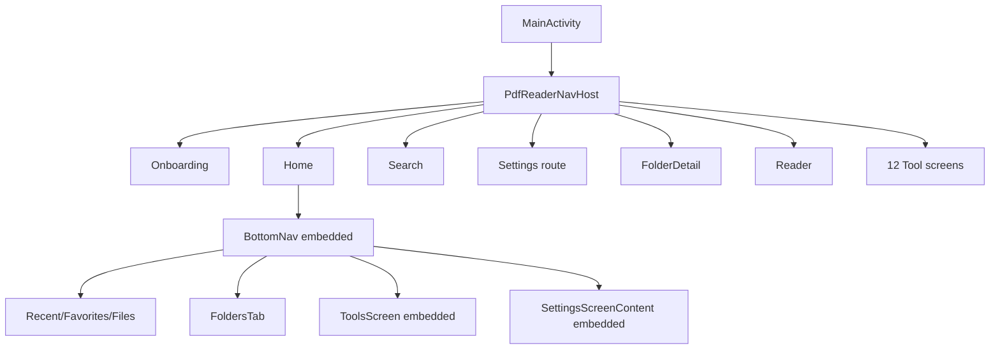
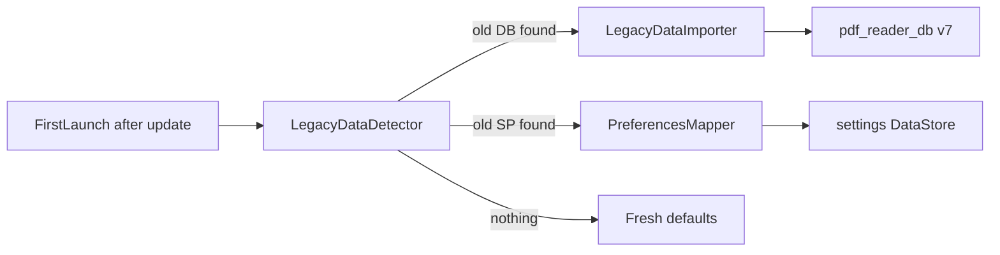
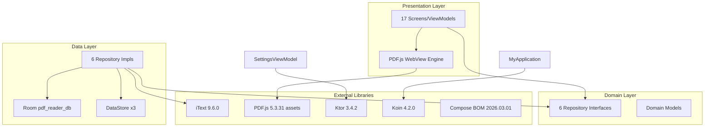

# PDF Explorer — MASTER TECHNICAL PLAN

**Analiz kapsamı:** Yalnızca yerel repo ([`pdf_explorer/`](c:\Users\faruk\OneDrive\Desktop\Belgeler\project\android\pdf\pdf_explorer))  
**Hedef:** `com.softcloud.pdfexplorer` üzerine güncelleme (versionCode **4**, versionName **0.4**)  
**Mevcut repo durumu:** `com.rejowan.pdfreaderpro` v**2.2.0** (versionCode **7**) — upstream: PdfReaderPro  
**Eski uygulama:** Farklı kod tabanı; depolama formatı bilinmiyor (APK/dump bekleniyor)

---

## 1. Doğrulanan Bilgiler

### Proje kimliği ve yapı
| Özellik | Değer | Kaynak |
|---------|-------|--------|
| Gradle modülleri | Tek modül `:app` | [`settings.gradle.kts`](settings.gradle.kts) |
| `applicationId` / `namespace` | `com.rejowan.pdfreaderpro` | [`app/build.gradle.kts`](app/build.gradle.kts) |
| `compileSdk` / `targetSdk` / `minSdk` | 36 / 36 / 24 | [`gradle/libs.versions.toml`](gradle/libs.versions.toml) |
| `versionCode` / `versionName` | 7 / 2.2.0 | [`app/build.gradle.kts`](app/build.gradle.kts) |
| Kotlin | 2.3.20 | version catalog |
| AGP | 9.1.0 | version catalog |
| Java | 21 | [`app/build.gradle.kts`](app/build.gradle.kts) |
| Gradle wrapper | 9.4.1 | `gradle/wrapper/` |
| Mimari | Clean Architecture + MVVM | README + paket yapısı |
| ~191 main Kotlin + 1 Java | `com.rejowan.pdfreaderpro.*` | repo taraması |
| 31 unit test + 7 instrumented test | `app/src/test`, `app/src/androidTest` | test dosyaları |

### Tech stack (doğrulandı)
- **UI:** Jetpack Compose + Material 3
- **DI:** Koin 4.2.0 — 5 modül ([`MyApplication.kt`](app/src/main/java/com/rejowan/pdfreaderpro/appClasses/MyApplication.kt))
- **DB:** Room 2.8.4, schema v7, KSP
- **Prefs:** DataStore Preferences 1.2.1
- **Navigation:** Navigation Compose 2.9.7 + Kotlin Serialization type-safe routes
- **PDF görüntüleme:** PDF.js 5.3.31 (bundled assets) + WebView
- **PDF düzenleme:** iText 9.6.0 + Android `PdfRenderer`
- **Thumbnail cache:** Disk (`cache/pdf_thumbnails/`) + memory LRU (50 entry)
- **Temalar:** Light / Dark / Black (AMOLED) + System — [`Theme.kt`](app/src/main/java/com/rejowan/pdfreaderpro/presentation/theme/Theme.kt)
- **Version Catalog + KSP:** Evet

### İzinler (manifest)
[`AndroidManifest.xml`](app/src/main/AndroidManifest.xml):
- `INTERNET`
- `REQUEST_INSTALL_PACKAGES`
- `READ_EXTERNAL_STORAGE` / `WRITE_EXTERNAL_STORAGE`
- `MANAGE_EXTERNAL_STORAGE`
- `allowBackup="false"`, `largeHeap="true"`, `requestLegacyExternalStorage="true"`

### Room Database (v7)
- **Dosya:** `pdf_reader_db` → `/data/data/{applicationId}/databases/pdf_reader_db`
- **Tablolar:** `recent`, `favorites`, `bookmarks`, `annotations`
- **Migration:** 4→5→6→7 ([`PdfDatabase.kt`](app/src/main/java/com/rejowan/pdfreaderpro/data/local/database/PdfDatabase.kt))
- **Schema export:** `app/schemas/.../5.json`, `6.json`, `7.json`

### DataStore
| Store | Dosya | Durum |
|-------|-------|-------|
| `settings` | `files/datastore/settings.preferences_pb` | Aktif — 17 ayar anahtarı |
| `pdf_passwords` | `files/datastore/pdf_passwords.preferences_pb` | Aktif — AES-GCM + Android Keystore |
| `reader_settings` | `files/datastore/reader_settings.preferences_pb` | **Kayıtlı ama kullanılmıyor** |

### Navigation (gerçek yapı)

- Type-safe routes: [`Routes.kt`](app/src/main/java/com/rejowan/pdfreaderpro/presentation/navigation/Routes.kt)
- NavHost: [`NavGraph.kt`](app/src/main/java/com/rejowan/pdfreaderpro/presentation/navigation/NavGraph.kt)
- **Dual pattern:** Settings ve Tools hem bottom tab hem (kısmen) NavHost route

### Koin modülleri
| Modül | Dosya | Bindings |
|-------|-------|----------|
| `databaseModule` | [`DatabaseModule.kt`](app/src/main/java/com/rejowan/pdfreaderpro/di/DatabaseModule.kt) | PdfDatabase + 4 DAO |
| `dataStoreModule` | [`DataStoreModule.kt`](app/src/main/java/com/rejowan/pdfreaderpro/di/DataStoreModule.kt) | settings + readerSettings (unused) |
| `networkModule` | [`NetworkModule.kt`](app/src/main/java/com/rejowan/pdfreaderpro/di/NetworkModule.kt) | Json + Ktor HttpClient |
| `repositoryModule` | [`RepositoryModule.kt`](app/src/main/java/com/rejowan/pdfreaderpro/di/RepositoryModule.kt) | 6 repo + ApkDownloadManager |
| `viewModelModule` | [`ViewModelModule.kt`](app/src/main/java/com/rejowan/pdfreaderpro/di/ViewModelModule.kt) | 17 ViewModel |

### Update sistemi (henüz mevcut — kaldırılacak)
Tam zincir: `SettingsViewModel` → `UpdateRepositoryImpl` (GitHub API) → `ApkDownloadManager` → `DownloadProgressSheet` / `UpdateAvailableSheet`  
Hardcoded repo: `ahmmedrejowan/PdfReaderPro` ([`SettingsViewModel.kt:36-37`](app/src/main/java/com/rejowan/pdfreaderpro/presentation/screens/settings/SettingsViewModel.kt))

---

## 2. Yanlış Tespit Edilen Bilgiler

| İddia / Doküman | Gerçek (repo) | Kanıt |
|-----------------|---------------|-------|
| Package = `com.softcloud.pdfexplorer` | **`com.rejowan.pdfreaderpro`** | `app/build.gradle.kts` |
| versionCode = 4, versionName = 0.4 | **versionCode = 7, versionName = 2.2.0** | `app/build.gradle.kts` — bunlar **hedef**, mevcut değil |
| iText 7 | **iText 9.6.0** | `libs.versions.toml`, README hatalı |
| Kotlin 2.3.10 | **Kotlin 2.3.20** | version catalog vs README |
| README: `READ_MEDIA_DOCUMENTS` | **Manifest'te yok** | `AndroidManifest.xml` |
| KNOWN_ISSUES: Android 11+ "scoped storage" | **API 30+ `MANAGE_EXTERNAL_STORAGE` zorunlu tutuluyor** | `MainActivity`, `PermissionBottomSheet`, onboarding |
| Dynamic Colors mevcut | **Altyapı var, UI'da kapalı** (`dynamicColor = false` sabit) | [`Theme.kt:166`](app/src/main/java/com/rejowan/pdfreaderpro/presentation/theme/Theme.kt), yalnızca `MainActivity`'de çağrı |
| Eski uygulama migration hazır | **Hiçbir `softcloud`/`pdfexplorer` referansı yok** | repo grep |
| `MIGRATION_4_5` = eski Play Store app migration | **Yalnızca aynı app v4→v5 internal migration** | `PdfDatabase.kt` — eski uygulama **farklı kod tabanı** olduğu için doğrudan uygulanamaz |
| Annotation özelliği production-ready | **`AnnotationDao` yalnızca testlerde kullanılıyor** | androidTest only |
| Reader settings ayrı DataStore'da | **Reader ayarları `settings` store'da** | `PreferencesRepositoryImpl` |

---

## 3. Eksik Kalan Analizler (Sizden Beklenen)

Eski uygulama **farklı kod tabanı** + depolama **bilinmiyor**. Migration tasarımı için şu bilgiler gerekli:

1. **SQLite:** DB dosya adı, schema version, tablo/kolon listesi (recent, favorites, bookmarks var mı?)
2. **SharedPreferences:** Dosya adları ve key listesi (tema, son okunan sayfa vb.)
3. **Eski APK veya `/data/data/com.softcloud.pdfexplorer/` dump** (debug cihazdan)
4. **Eski uygulamada PDF araçları / annotation / bookmark var mıydı?**
5. **Kayıtlı şifreler** eski uygulamada nasıl tutuluyordu?

Bu bilgiler gelene kadar migration bölümü **taslak** kalır; aşağıdaki §5'te olası senaryolar listelenmiştir.

---

## 4. Risk Analizi

### 4.1 Lisans riskleri (yerel dosya kanıtı)

| Bileşen | Lisans | Risk |
|---------|--------|------|
| Proje | **GPL v3** | [`LICENSE`](LICENSE) — türev çalışmalar açık kaynak olmalı |
| iText 9.6.0 | **AGPL v3** | Kapalı kaynak + Play Store ticari dağıtım için ticari lisans veya kaldırma/değiştirme gerekir |
| PDF.js 5.3.31 | Apache 2.0 | Düşük |
| Bouncy Castle 1.83 | BC License (permissif) | Düşük |
| AndroidX / Koin / Coil / Ktor / Timber / Lottie / Reorderable | Apache 2.0 | Düşük |
| Licensy Compose 1.1.0 | `com.rejowan:licensy-compose` | Lisans metni repoda yok — attribution kontrol edilmeli |

**iText notu:** README "iText 7" der; gerçek sürüm 9.6.0. AGPL, GPL ile uyumlu dağıtılabilir ancak **kaynak kodun kullanıcıya sunulması** gerekir. Ticari kapalı kaynak hedefi varsa iText alternatif değerlendirmesi zorunlu.

### 4.2 İzin ve depolama riskleri

**`MANAGE_EXTERNAL_STORAGE`:**
- Onboarding ve `MainActivity` API 30+ için `Environment.isExternalStorageManager()` olmadan uygulamayı **kullanıma kapalı** sayıyor
- `PdfFileRepositoryImpl` aslında **MediaStore** sorgusu kullanıyor — teorik olarak liste için All Files Access şart değil
- Ancak `renamePdf()` → `File.renameTo()`, `File(path).exists()`, `MediaStore.Files.FileColumns.DATA` (API 29+ kısıtlı) → **mevcut mimari direct path'e bağımlı**
- PDF araçları çıktıları `Environment.DIRECTORY_DOCUMENTS` vb. direct path ile yazıyor
- **Sonuç:** Mevcut kodda All Files Access **pratikte zorunlu**; SAF/MediaStore refactor ile kaldırılabilir ama **büyük mimari iş** (Faz 2+)

**`REQUEST_INSTALL_PACKAGES` + GitHub update:**
- Kaldırılması planlandı — doğru yön
- Kaldırılınca `INTERNET` yalnızca gelecekteki ihtiyaçlar için kalır (şu an update + network PDF loader)

### 4.3 WebView güvenlik riskleri

[`PdfJsWebView.kt`](app/src/main/java/com/rejowan/pdfreaderpro/presentation/components/pdf/PdfJsWebView.kt):
- `javaScriptEnabled = true` (PDF.js için gerekli)
- `allowFileAccess = false`, `allowContentAccess = false` — iyi
- `WebViewAssetLoader` ile sanal domain — iyi pattern

[`WebInterface.kt`](app/src/main/java/com/rejowan/pdfreaderpro/presentation/components/pdf/WebInterface.kt):
- 32 `@JavascriptInterface` metodu
- `handleBase64Data()` — JS'den arbitrary Base64 kabul
- `fileName`/`mimeType` JS template string interpolation — injection riski
- `shouldOverrideUrlLoading` external URL handling **commented out**

[`pdfcompose/PdfViewer.kt`](app/src/main/java/com/rejowan/pdfreaderpro/presentation/components/pdfcompose/PdfViewer.kt):
- Compose `onRelease`'de **`webView.destroy()` yok** — memory leak riski

### 4.4 Performans riskleri (büyük PDF)

| Alan | Risk | Dosya |
|------|------|-------|
| Reader save/print | Tüm PDF Base64 → `ByteArray` | `WebInterface.kt` |
| Tool thumbnails | 50–100 bitmap ViewModel state'te | `RotateViewModel`, `ReorderViewModel`, `RemovePagesViewModel` |
| iText merge/split | Tüm doküman memory'de | `PdfToolsRepositoryImpl.kt` |
| Thumbnail LRU | Count-based (50), byte-based değil | `PdfThumbnailManager.kt` |
| `largeHeap="true"` | Bellek baskısını maskeler | manifest |
| Page count scan | Her refresh'te tüm PDF'ler için `getPageCount` | `PdfFileRepositoryImpl.kt:170` |

### 4.5 Memory leak riskleri

- WebView lifecycle cleanup eksik (yukarı)
- `PdfThumbnailManager` object + 50 bitmap LRU — app lifetime
- 12 tool ViewModel'de `copyUriToCache()` input stream `.use` eksik
- `PdfRenderer`/`ParcelFileDescriptor` error path cleanup eksik (tool ViewModels, `FormattingUtils.kt`)

### 4.6 Play Store yayın riskleri (manifest + kod tabanından)

| Risk | Detay |
|------|-------|
| Package mismatch | Play'deki `com.softcloud.pdfexplorer` ≠ repo `com.rejowan.pdfreaderpro` — güncelleme imkansız |
| versionCode | Play son sürüm 3 → yeni 4 olmalı; repo 7 (upstream numaralandırma) |
| `MANAGE_EXTERNAL_STORAGE` | Manifest'te declare — review/policy riski yüksek |
| `REQUEST_INSTALL_PACKAGES` | Kaldırılmadan review riski |
| GPL/AGPL | Kaynak kod erişimi ve lisans uyumu |
| Upstream branding | GitHub `ahmmedrejowan/PdfReaderPro`, F-Droid metadata `com.rejowan.pdfreaderpro` |
| `allowBackup="false"` | Kullanıcı verisi cihaz transferinde kaybolur — bilinçli mi? |
| Accessibility | KNOWN_ISSUES: content description eksikleri |

---

## 5. Migration Analizi

### 5.1 Aynı package güncelleme ne korur?

`com.softcloud.pdfexplorer` + aynı signing key ile güncelleme:
- `/data/data/com.softcloud.pdfexplorer/` **korunur** (silinmez)
- Yeni kod farklı dosya adları/schema bekliyorsa **otomatik uyum olmaz**

### 5.2 Yeni uygulamanın beklediği veri formatı

**Room (`pdf_reader_db` v7):**
- `recent`: name, path, size, lastOpened, totalPages, lastPage
- `favorites`: name, path, size, dateModified, parentFolder
- `bookmarks`: pdfPath, pageNumber, title, createdAt
- `annotations`: pdfPath, pageNumber, type, content, color, coords, timestamps

**DataStore (`settings`):** 17 key — [`PreferencesRepositoryImpl.kt`](app/src/main/java/com/rejowan/pdfreaderpro/data/repository/PreferencesRepositoryImpl.kt)

**Şifreler:** `pdf_passwords` DataStore + Keystore alias `pdf_password_key` — path hash key (`pwd_{path.hashCode()}`)

**SharedPreferences (yeni app):** yalnızca `recent_searches` / `searches` ([`SearchScreen.kt`](app/src/main/java/com/rejowan/pdfreaderpro/presentation/screens/search/SearchScreen.kt))

**Disk cache (migration gerekmez):** `cache/pdf_thumbnails/`, tool temp dirs — yeniden üretilir

### 5.3 Migration gerekir mi?

| Senaryo | Migration |
|---------|-----------|
| Eski DB yok / farklı isim | **Evet** — first-launch import veya boş başlangıç |
| Eski DB benzer tablolar | **Evet** — custom Room migration veya one-shot import |
| Eski SharedPreferences ayarları | **Evet** — key mapping + DataStore yazımı |
| PDF dosya path'leri DB'de | Path'ler diskte hâlâ varsa **kısmen otomatik**; yoksa orphan kayıt temizliği |
| Kayıtlı PDF şifreleri | Keystore aynı app update'te kalır; **eski format farklıysa** import gerekir |
| `MIGRATION_4_5` (recent_table/favorite) | **Eski softcloud app için geçerli değil** (farklı codebase) — yalnızca referans |

### 5.4 Önerilen migration mimarisi (implementasyon fazında)

**Sizden gelen APK/dump sonrası:** `LegacyDataDetector` + `LegacyDataImporter` spesifikasyonu yazılacak.

---

## 6. Play Store Analizi (Yerel Kod Perspektifi)

### Yayın öncesi zorunlu değişiklikler
1. `applicationId` → `com.softcloud.pdfexplorer`
2. `namespace` + tüm `com.rejowan.pdfreaderpro` referansları
3. `versionCode = 4`, `versionName = "0.4"`
4. Signing: mevcut Play key ile [`keystore.properties`](keystore.properties.template)
5. GitHub update sisteminin **tamamen kaldırılması**
6. `REQUEST_INSTALL_PACKAGES` kaldırılması
7. Upstream branding temizliği (app name, icon, GitHub owner/repo, F-Droid metadata)
8. Store listing / privacy policy (kod: `allowBackup=false`, şifre Keystore, INTERNET)

### İzin stratejisi kararı (kritik)
- **Kısa vadede:** Mevcut `MANAGE_EXTERNAL_STORAGE` ile hızlı yayın mümkün ama review riski yüksek
- **Orta vadede:** SAF + MediaStore scoped model — Play uyumluluğu için önerilir
- Karar sizin; roadmap'te iki faz olarak ayrıldı

---

## 7. Kod Kalitesi

### Güçlü yönler
- Clean Architecture katman ayrımı net
- Type-safe navigation
- Room migration zinciri (4→7) ve schema export
- ProGuard rules: WebInterface, Room, iText, Serialization ([`proguard-rules.pro`](app/proguard-rules.pro))
- 31 unit test — ViewModel ve repository coverage iyi
- WebViewAssetLoader ile güvenli asset serving
- `PasswordStorage` — Android Keystore + AES-GCM

### Zayıf yönler / code smell
- **NavGraph TODO:** `Tools` ve `ToolResult` route boş ([`NavGraph.kt:105,215`](app/src/main/java/com/rejowan/pdfreaderpro/presentation/navigation/NavGraph.kt))
- **Presentation → DAO direct access:** `ReaderViewModel` bookmark DAO'ya doğrudan erişiyor (repository pattern ihlali)
- **Unused code:** `reader_settings` DataStore, `AnnotationDao` production'da, `SharedPreferencePdfSettingsSaver` hiç çağrılmıyor
- **Deprecated API hâlâ wired:** `onSavePdf`, `SimplePdfPrintAdapter`, `savePdfFlow()`
- **Dual navigation:** Settings/Tools hem tab hem route — kafa karıştırıcı
- **SettingsScreenContent.kt** ~2665 satır — god file
- **PdfViewer.kt** ~2382 satır — bakım zorluğu
- **Password key collision:** `path.hashCode()` — teorik çakışma riski

### TODO / FIXME envanteri
| Dosya | Satır | İçerik |
|-------|-------|--------|
| `NavGraph.kt` | 105, 215 | ToolsScreen, ToolResultScreen |
| `WebInterface.kt` | 285 | Remove onSavePdf |
| `PdfPrintAdapter.kt` | 13 | Remove in future |
| `data_extraction_rules.xml` | 8 | Backup rules placeholder |

---

## 8. Teknik Borç

| Borç | Etki | Öncelik |
|------|------|---------|
| Package/namespace upstream'den softcloud'a | Play güncelleme **bloker** | P0 |
| GitHub update sistemi | Gereksiz izin + upstream bağımlılık | P0 |
| Eski app migration yok | Kullanıcı verisi kaybı | P0 |
| `MANAGE_EXTERNAL_STORAGE` | Play review + UX | P1 |
| WebView lifecycle | Memory leak, crash | P1 |
| Base64 full-PDF save path | OOM büyük dosyalarda | P1 |
| iText AGPL lisans | Ticari/hukuki risk | P1 |
| Dynamic color UI bağlantısı yok | Feature incomplete | P2 |
| Annotation feature yarım | Schema var, UI yok | P2 |
| MediaStore DATA column | API 29+ deprecated | P2 |
| F-Droid metadata upstream package | Yanlış metadata | P3 |
| README/version catalog tutarsızlıkları | Dokümantasyon | P3 |

---

## 9. Öneriler

### Stratejik
1. **Faz 0 (Bloker):** Package rename + version + signing + migration detector — kod değişikliği öncesi sizden eski app dump
2. **Faz 1 (Play MVP):** Update sistemi kaldır, upstream branding temizle, migration import, regression test
3. **Faz 2 (Stabilizasyon):** WebView lifecycle, OOM paths, resource leak fixes
4. **Faz 3 (Play uyumu):** MANAGE_EXTERNAL_STORAGE → SAF/MediaStore refactor
5. **Faz 4 (Ürün):** Annotation UI, dynamic color setting, accessibility

### MANAGE_EXTERNAL_STORAGE vs SAF (yerel kod analizi)
- **Kaldırılabilir mi?** Evet, ama refactor gerekir
- **Minimum değişim:** MediaStore URI tabanlı model; rename/delete için `ContentResolver`; tools output için SAF `CREATE_DOCUMENT`
- **Kullanıcı deneyimi:** "All files" yerine klasör seçimi veya sınırlı MediaStore taraması
- **Kısa vade öneri:** Play MVP için mevcut model + güçlü izin gerekçesi; orta vade SAF geçişi planla

### iText alternatifleri (gelecek değerlendirme)
- **PdfBox Android** (Apache 2.0) — merge/split/compress kapasitesi sınırlı olabilir
- **qpdf** (native) — güçlü ama NDK karmaşıklığı
- **Android PdfDocument API** — basit işlemler için
- **Ticari iText lisansı** — mevcut kodu korur

### Dependency graph (özet)

---

## 10. Master Development Roadmap

### Faz 0 — Hazırlık ve Bilgi Toplama (1–2 hafta)
- [ ] Eski APK veya data dump analizi (sizden)
- [ ] Migration spec dokümanı (tablo/key mapping)
- [ ] Play release checklist (package, version, signing)
- [ ] Lisans stratejisi kararı (GPL açık kaynak mı, iText ticari mi?)

### Faz 1 — Play Store MVP (2–3 hafta)
- [ ] `applicationId` / `namespace` → `com.softcloud.pdfexplorer`
- [ ] versionCode 4, versionName 0.4
- [ ] GitHub update kaldır: `UpdateRepository*`, `ApkDownloadManager`, `NetworkModule`, Ktor deps, UI sheets, prefs keys
- [ ] `REQUEST_INSTALL_PACKAGES` kaldır
- [ ] `LegacyDataImporter` (eski dump'a göre)
- [ ] Branding: app name, icon, strings, upstream GitHub referansları
- [ ] Regression: intent PDF open, recent/favorites, tools smoke test
- [ ] ProGuard release build doğrulama

### Faz 2 — Stabilizasyon ve Kalite (3–4 hafta)
- [ ] WebView `destroy()` + `removeJavascriptInterface()` lifecycle
- [ ] Base64 save → streaming/chunked veya SAF-only save
- [ ] Tool ViewModel stream leak fixes
- [ ] PdfRenderer error-path cleanup
- [ ] Thumbnail LRU byte-size based
- [ ] `PdfFileRepository` refresh optimizasyonu (lazy page count)
- [ ] NavGraph TODO routes tamamla veya kaldır
- [ ] Deprecated API cleanup (`onSavePdf` chain)

### Faz 3 — Depolama ve Play Uyumu (4–6 hafta)
- [ ] `MANAGE_EXTERNAL_STORAGE` kaldırma analizi → SAF/MediaStore implementasyonu
- [ ] URI-first file model (`PdfFile` path → uri primary)
- [ ] Rename/delete MediaStore API
- [ ] Tool output SAF integration
- [ ] Permission UX yeniden tasarım (onboarding)

### Faz 4 — Ürün Geliştirme (devam eden)
- [ ] Dynamic color settings UI
- [ ] Annotation UI (Room schema hazır)
- [ ] Accessibility content descriptions
- [ ] iText alternatif veya lisans
- [ ] Performance profiling büyük PDF (500+ sayfa)
- [ ] Instrumented test coverage artırımı

### Faz 5 — Bakım
- [ ] Dependency güncellemeleri (kontrollü)
- [ ] PDF.js asset güncelleme prosedürü
- [ ] CHANGELOG / KNOWN_ISSUES senkronizasyonu

---

## 11. Lisans Analizi (Geliştirme Öncesi Bloker — Tamamlandı)

**Kaynak:** `gradle/libs.versions.toml`, `app/build.gradle.kts`, `./gradlew :app:dependencies --configuration releaseRuntimeClasspath`, Maven POM (Gradle cache), bundled assets, [`LICENSE`](LICENSE), [`SettingsScreenContent.kt`](app/src/main/java/com/rejowan/pdfreaderpro/presentation/screens/settings/SettingsScreenContent.kt)

### 11.1 iText — Doğrulanmış Bilgiler

| Soru | Cevap (kanıtlı) |
|------|-----------------|
| **Direct artifact'ler** | `com.itextpdf:itext-core:9.6.0` (POM aggregator), `com.itextpdf:bouncy-castle-adapter:9.6.0` |
| **Resmi lisans (POM)** | **GNU Affero General Public License v3** — `itext-core-9.6.0.pom` ve `root-9.6.0.pom` satır 18–22 |
| **AGPL build kanıtı** | `commons-9.6.0.jar` içinde `UnderAgplITextProductEventProcessor.class` |
| **Transitive iText modülleri (9.6.0)** | barcodes, font-asian, forms, hyph, io, kernel, layout, pdfa, sign, styled-xml-parser, svg, bouncy-castle-connector, pdfua, commons |
| **GPL/Apache/ticari?** | Resmi Maven metadata **yalnızca AGPL v3** listeler; ticari lisans POM'da yok (ayrı satın alma modeli) |

### 11.2 iText × Proje GPL-3.0 Uyumu

- Proje: **GPL-3.0** ([`LICENSE`](LICENSE), [`fdroid/com.rejowan.pdfreaderpro.yml`](fdroid/com.rejowan.pdfreaderpro.yml))
- **Uyumluluk:** AGPL v3, GPL v3 ile uyumlu copyleft ailesi; birleşik eser dağıtımında **AGPL yükümlülükleri** (kaynak kod erişimi) de geçerli
- **Play Store / kapalı kaynak riski:** Kaynak kodu kullanıcıya sunulmadan kapalı kaynak Play yayını **GPL ve AGPL ile çelişir** — **YÜKSEK RİSK**
- **Açık kaynak Play yayını:** Uyumlu; kaynak erişimi + lisans metinleri gerekir

### 11.3 iText Dışı PDF Bileşenleri

| Bileşen | Sürüm | Lisans kaynağı | Rol |
|---------|-------|----------------|-----|
| **PDF.js** (bundled) | 5.3.31 (`pdf.mjs` satır 24) | Apache-2.0 (asset header) | Görüntüleme (WebView) |
| **Android PdfRenderer** | Platform API | AOSP | Thumbnail, tool preview |
| **iText 9.6.0** | Maven | AGPL-3.0 | 12 PDF aracı ([`PdfToolsRepositoryImpl.kt`](app/src/main/java/com/rejowan/pdfreaderpro/data/repository/PdfToolsRepositoryImpl.kt)) |

### 11.4 Üçüncü Parti Lisans Tablosu (Direct + Bundled + Kritik Transitive)

| Kütüphane | Maven Koordinat | Sürüm | Lisans (POM/asset) | Ticari | GPL uyumu | Risk |
|-----------|-----------------|-------|-------------------|--------|-----------|------|
| **iText Core** | `com.itextpdf:itext-core` | 9.6.0 | **AGPL-3.0** | Copyleft uyumu veya ticari lisans gerekir | Uyumlu (copyleft) | **YÜKSEK** |
| **iText BC Adapter** | `com.itextpdf:bouncy-castle-adapter` | 9.6.0 | AGPL (parent) | Aynı | Uyumlu | **YÜKSEK** |
| **Bouncy Castle** | `org.bouncycastle:bcprov-jdk18on`, `bcpkix-jdk18on` | 1.83 | Bouncy Castle Licence | Evet | Uyumlu | Düşük |
| **PDF.js** | bundled assets | 5.3.31 | Apache-2.0 | Evet | Uyumlu | Düşük |
| **Android PdfRenderer** | platform | — | AOSP | Evet | Uyumlu | Düşük |
| Compose BOM + UI/M3/Icons | `androidx.compose:compose-bom` + BOM | 2026.03.01 | Apache-2.0 | Evet | Uyumlu | Düşük |
| Core KTX | `androidx.core:core-ktx` | 1.18.0 | Apache-2.0 | Evet | Uyumlu | Düşük |
| Activity Compose | `androidx.activity:activity-compose` | 1.13.0 | Apache-2.0 | Evet | Uyumlu | Düşük |
| Lifecycle Compose | `androidx.lifecycle:lifecycle-*-compose` | 2.10.0 | Apache-2.0 | Evet | Uyumlu | Düşük |
| Navigation Compose | `androidx.navigation:navigation-compose` | 2.9.7 | Apache-2.0 | Evet | Uyumlu | Düşük |
| Room | `androidx.room:room-*` | 2.8.4 | Apache-2.0 | Evet | Uyumlu | Düşük |
| DataStore | `androidx.datastore:datastore-preferences` | 1.2.1 | Apache-2.0 | Evet | Uyumlu | Düşük |
| WebKit | `androidx.webkit:webkit` | 1.15.0 | Apache-2.0 | Evet | Uyumlu | Düşük |
| Splash Screen | `androidx.core:core-splashscreen` | 1.2.0 | Apache-2.0 | Evet | Uyumlu | Düşük |
| Koin | `io.insert-koin:koin-*` | 4.2.0 | Apache-2.0 | Evet | Uyumlu | Düşük |
| Kotlinx Serialization | `org.jetbrains.kotlinx:kotlinx-serialization-json` | 1.10.0 | Apache-2.0 | Evet | Uyumlu | Düşük |
| Ktor Client | `io.ktor:ktor-client-*` | 3.4.2 | Apache-2.0 | Evet | Uyumlu | Düşük (kaldırılacak) |
| Coil | `io.coil-kt:coil-compose` | 2.7.0 | Apache-2.0 | Evet | Uyumlu | Düşük |
| Timber | `com.jakewharton.timber:timber` | 5.0.1 | Apache-2.0 | Evet | Uyumlu | Düşük |
| Lottie | `com.airbnb.android:lottie-compose` | 6.7.1 | Apache-2.0 | Evet | Uyumlu | Düşük |
| Reorderable | `sh.calvin.reorderable:reorderable` | 3.0.0 | Apache-2.0 | Evet | Uyumlu | Orta (küçük maintainer) |
| Licensy | `com.rejowan:licensy-compose` | 1.1.0 | Apache-2.0 (POM) | Evet | Uyumlu | Orta (tek maintainer) |
| Jackson (transitive/iText) | `com.fasterxml.jackson.core:jackson-databind` | 2.21.1 | Apache-2.0 | Evet | Uyumlu | Düşük |
| SLF4J (transitive/iText) | `org.slf4j:slf4j-api` | 2.0.17 | MIT | Evet | Uyumlu | Düşük |
| Apache Santuario xmlsec (transitive/iText sign) | `org.apache.santuario:xmlsec` | 3.0.6 | Apache-2.0 | Evet | Uyumlu | Düşük |
| Kotlin stdlib (transitive) | `org.jetbrains.kotlin:kotlin-stdlib` | 2.3.20 | Apache-2.0 | Evet | Uyumlu | Düşük |
| JUnit / MockK / Turbine / Espresso | test deps | çeşitli | EPL/Apache/MIT | Test scope | Uyumlu | Düşük |

### 11.5 Play Store / Lisans Blokerleri

1. **iText AGPL-3.0** — Kapalı kaynak ticari dağıtım blokeri (kaynak sunumu veya ticari lisans/alternatif şart)
2. **Proje GPL-3.0** — Aynı copyleft yükümlülükleri
3. **Attribution hatası:** UI'da Bouncy Castle **MIT** gösteriliyor; POM **Bouncy Castle Licence** diyor ([`SettingsScreenContent.kt:2261-2265`](app/src/main/java/com/rejowan/pdfreaderpro/presentation/screens/settings/SettingsScreenContent.kt))
4. **APK packaging:** `app/build.gradle.kts` satır 87–88 `META-INF/LICENSE.md` exclude — lisans dosyalarının APK'dan düşme riski

### 11.6 iText Alternatifleri (Lisans Açısından)

| Alternatif | Lisans | Not |
|------------|--------|-----|
| **Apache PDFBox Android** | Apache-2.0 | Merge/split/watermark kapasitesi iText kadar geniş olmayabilir — PoC gerekir |
| **qpdf (JNI/NDK)** | Apache-2.0 | Güçlü; NDK karmaşıklığı |
| **Android PdfDocument/PdfRenderer** | AOSP | Sınırlı düzenleme |
| **iText ticari lisans** | Ticari | Mevcut kodu korur; maliyet |
| **GPL/AGPL açık kaynak devam** | Copyleft | Mevcut stack ile uyumlu |

### 11.7 Bakım Durumu Analizi

**Metodoloji sınırı:** Yerel Gradle cache'te `maven-metadata.xml` bulunamadı; **resmi son sürüm tarihi yerel dosyalardan doğrulanamaz.** Aşağıdaki tablo proje dosyaları + POM SCM/CI metadata + dependency resolve kanıtına dayanır.

| Kütüphane | Pinlenen sürüm | Resolve | Bakım göstergesi (POM/repo) | Deprecate? (yerel kanıt) | Uzun vade riski |
|-----------|----------------|---------|----------------------------|--------------------------|-----------------|
| iText | 9.6.0 | OK | Jenkins CI, Jira, Apryse org | Hayır | **YÜKSEK (lisans)** + orta (vendor lock-in) |
| PDF.js (bundled) | 5.3.31 | N/A | Manuel asset güncelleme | Hayır | **Orta** (manuel güvenlik güncellemesi) |
| AndroidX stack | güncel | OK | Google | Hayır | Düşük |
| Kotlin/AGP | 2.3.20 / 9.1.0 | OK | JetBrains/Google | Hayır | Düşük |
| Koin | 4.2.0 | OK | insert-koin.io | Hayır | Düşük |
| Coil | 2.7.0 | OK | GitHub SCM | Yerel kanıt yok | Orta (major geçiş ihtimali — doğrulanmadı) |
| Timber | 5.0.1 | OK | GitHub | Hayır | Düşük (stabil) |
| Lottie | 6.7.1 | OK | Airbnb/GitHub | Hayır | Düşük |
| Ktor | 3.4.2 | OK | JetBrains | Hayır | Düşük (zaten kaldırılacak) |
| Reorderable | 3.0.0 | OK | GitHub (Calvin-LL) | Hayır | Orta (tek maintainer) |
| Licensy | 1.1.0 | OK | `com.rejowan` | Hayır | Orta (tek maintainer, upstream author) |
| Bouncy Castle | 1.83 | OK | GitHub issues | Hayır | Düşük |
| JUnit 4 | 4.13.2 | OK | — | Test-only legacy | Düşük (test scope) |

**Uzun vadede sorun çıkarabilecek bağımlılıklar:**
1. **iText 9.6.0 (AGPL)** — Lisans blokeri #1
2. **PDF.js bundled** — Otomatik dependency update yok; güvenlik yamaları manuel
3. **com.rejowan:licensy** — Bus factor / upstream author bağımlılığı
4. **sh.calvin.reorderable** — Küçük topluluk kütüphanesi
5. **Coil 2.7.0** — Major sürüm geçişi proje dosyalarında belgelenmemiş; izlenmeli
6. **Ktor** — Update sistemi kaldırılınca gereksiz kalır

### 11.8 Lisans Kapısı — Geliştirme Öncesi Karar

Geliştirmeye geçmeden önce **aşağıdakilerden biri** seçilmeli:

- **A)** Proje GPL-3.0 açık kaynak kalır + kaynak dağıtım süreci kurulur (Play dahil)
- **B)** iText için **ticari lisans** satın alınır
- **C)** iText kaldırılır; Apache-2.0 alternatifle PDF araçları yeniden implement edilir (PoC zorunlu)

---

## Karar Bekleyen Konular

1. **Lisans modeli (BLOKER):** A / B / C seçeneklerinden hangisi?
2. **MANAGE_EXTERNAL_STORAGE:** Faz 1'de tutulsun mu, yoksa Faz 3'e kadar beklenmeden refactor mu?
3. **Migration kapsamı:** Recent + Favorites yeterli mi, bookmarks/annotations eski app'te var mıydı?

---

## Referans Dosyalar (Hızlı Erişim)

- Build: [`app/build.gradle.kts`](app/build.gradle.kts), [`gradle/libs.versions.toml`](gradle/libs.versions.toml)
- Manifest: [`app/src/main/AndroidManifest.xml`](app/src/main/AndroidManifest.xml)
- DB: [`PdfDatabase.kt`](app/src/main/java/com/rejowan/pdfreaderpro/data/local/database/PdfDatabase.kt)
- DI: [`app/src/main/java/com/rejowan/pdfreaderpro/di/`](app/src/main/java/com/rejowan/pdfreaderpro/di/)
- Navigation: [`Routes.kt`](app/src/main/java/com/rejowan/pdfreaderpro/presentation/navigation/Routes.kt), [`NavGraph.kt`](app/src/main/java/com/rejowan/pdfreaderpro/presentation/navigation/NavGraph.kt)
- PDF Engine: [`PdfViewer.kt`](app/src/main/java/com/rejowan/pdfreaderpro/presentation/components/pdf/PdfViewer.kt)
- Tools: [`PdfToolsRepositoryImpl.kt`](app/src/main/java/com/rejowan/pdfreaderpro/data/repository/PdfToolsRepositoryImpl.kt)
- Issues: [`KNOWN_ISSUES.md`](KNOWN_ISSUES.md)
